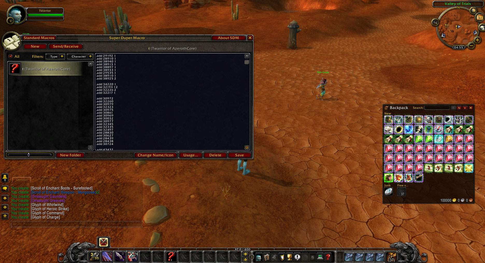

# WoWSims to `add` commands
 Extracts gear from a WoWSims character `.json` and creates a set of `.add` for gear, enchants, gems, and glyphs.

Uses data from WOTLK 335a Spell.dbc and AzerothCore `acore_world.item_template`.


## How to use


### Data
export `.json` data from a WoWSims character sim


### Run script

#### Option1: Use web `web`
  no dependencies needed

https://sogladev.github.io/wowsims-to-commands/

#### Option2: Use `Docker Compose`
requires dependencies:
1. Spell.dbc exported to SQL DB with stoneharry spell editor
2. Azerothcore DB

Replace Databases connection settings to yours, after than run in project folder:
```
docker compose up -d
```
If this is your first deployment, also run this command:
```
docker compose exec app bash init.sh
```

### ingame
paste commands

optional (`superdupermacro`) addon to paste in 1 macro https://felbite.com/addon/4135-superdupermacro/


